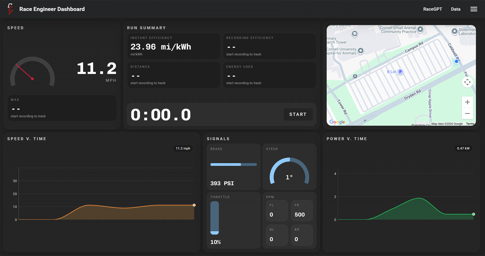

# 📊 Race Engineer Dashboard

🛠️ **Donte and Adi** ⚙️



---

## ✅ Specifications

**Sensor Data** displays 📈  
Implement a Kalman filter for accurate location data, and a low pass filter for denoising timeseries sensors.

- **Speed** time series, live, and max value
- **Power** time series (calculated from current and voltage data)
- **GPS** location display with Google Maps
- Live **Steering** angle, **Brake** pressure, **Throttle**, and **RPM** on all wheels

**Calculated Data** displays for relevant metrics

- **Distance** calculated from aggregating GPS data
- **Energy Usage** calculated from power
- **Efficiency** instantaneous and average over a run

**RaceGPT Integration** via a sidebar allowing two modes.

- Manually request LLM responses (5s buffer between responses)
- Automatically request and display LLM responses based on set frequency >5s

Timestamping and stopwatch features for tracking lap and race time ⌚  
Implement automatic mode switching between ROS subscriber and cellular modem sensor
data channels for reliable data pipeline.

---

## 🚀 Getting Started

1. **Running the Project**

   Create a `.env` file in the the root directory (not under `/backend` or `/frontend`).
   See `.env.example` for more info. The format for the `.env` is also listed below here for reference.

   ```env
    VITE_GOOGLE_MAPS_API_KEY=Your_Google_Maps_API_Key
    VITE_GOOGLE_MAP_ID=Your_Google_Map_ID

    TS_CLIENT_ID=your tailscale client id
    TS_CLIENT_SECRET=your tailscale client secret

    # Tailscale IP of the DAQ machine (ros-tailscale-service)
    TAILSCALE_IP=100.110.98.26
    # Port the rosbag API listens on (on the DAQ machine)
    ROSBAG_API_PORT=8080
   ```

   Make sure Docker containers and volumes for this project are not running already.
   Then, run `docker compose up --build` to get all containers running.

   The frontend client UI should be running on `port 3000`.  
   The backend healthcheck endpoint is on the root of `port 8000`.

   Integration with RaceGPT is done via serial connection. Connect your machine to a
   machine running RaceGPT with a USB, and the dashboard should connect when built.

2. **Frontend Testing**

   Refer to `frontend/README.md` for more information.  
   **[Bun Installation](https://bun.com/docs/installation)**: The frontend uses **Bun** instead of **NodeJS** as a package manager
   and runtime. The installation is linked [here](https://bun.com/docs/installation). Then, run the following commands in the
   terminal to test/run the frontend in isolation.  
   This will start the frontend development environment with HMR and Vite at `port 5173`.

   ```bash
   cd frontend
   bun dev
   ```

   **Google Maps**: To get location data and Google Maps properly displaying while
   running only the frontend with `bun dev`,
   create a `.env` file in the `/frontend` directory. Follow the `.env.example` in the
   `/frontend` and create the environment variables below.

   ```env
   VITE_GOOGLE_MAPS_API_KEY=<Your Google Maps API Key here>
   VITE_GOOGLE_MAP_ID=<Your Google Maps Map ID from Google Cloud console>
   ```

   Instructions for getting your own `API_KEY` and `MAP_ID` are in `frontend/README.md`.

3. **Backend Troubleshooting**

   Refer to `backend/README.md`.

---

## 🤖 ROS Subscriber Data

For the ROS2 subscriber, first get the ROS2 publisher IP address from:

```sh
ssh cev@<daq tailscale ip> "docker exec ts-authkey-container tailscale ip" | head -n1)
```

Make sure this matches the ip in the `docker-compose.yml` file.

We set it manually, not via env var, because the publisher IP should not change.

## 💬 RaceGPT Integration

Plug your machine into another machine running **RaceGPT** via USB.
The Race Engineer Dashboard should be connected and able to request
custom LLM responses on the live data snapshots with analysis.

As mentioned above, there are two modes for requesting responses on the sidebar.

- Manually request LLM responses (5s buffer between responses)
- Automatically request and display LLM responses based on a set frequency >5s

---

# 🏗️ Design and Architecture

The Race Engineer Dashboard is built as a **real-time, distributed system** with a clear separation between data ingestion, processing, and visualization. The architecture is designed to prioritize **low-latency streaming**, **fault tolerance**, and **modular extensibility**.

---

## 🔄 System Overview

At a high level, the system follows a streaming pipeline:

```
ROS2 Sensors → Backend (Python) → WebSocket Stream → Frontend (React)
                                          ↓
                                  RaceGPT Integration
```

---

## ⚙️ Backend Architecture (Python + ROS2)

The backend acts as the **data ingestion and streaming layer**.

- Subscribes to **ROS2 topics** publishing live sensor data using Python ROS libraries
- Maintains an **in-memory rolling buffer (~1000 snapshots)** of the most recent telemetry
- Applies filtering logic (e.g., Kalman, low-pass) before broadcasting
- Exposes a **WebSocket endpoint** at `/ws/stream` for real-time data delivery
- Provides REST endpoints for:
  - RaceGPT requests (`/racegpt`)
  - ROSbag control (`/bag/*`)

**Key design decisions:**

- WebSockets over HTTP polling → minimizes latency and avoids redundant requests
- In-memory buffering → enables quick access to recent history without database overhead
- Stateless endpoints → simplifies scaling and failure recovery

---

## 💻 Frontend Architecture (React + TypeScript + Bun)

The frontend is the **real-time visualization and computation layer**.

**Core stack:**

- **React + TypeScript** → component-based architecture with type safety
- **Vite** → fast dev server + HMR
- **Bun** → faster runtime and package management
- **Tailwind + DaisyUI + MUI Charts** → rapid UI development and reusable components

**Responsibilities:**

- Consumes live data from `/ws/stream` via WebSockets
- Maintains its own **rolling buffer (~1200 data points/~10s)** for time-series visualization
- Performs all **client-side computations**, including:
  - Unit conversions i.e. m/s → mph
  - Derived metrics (efficiency, energy, distance)
  - Data formatting for visualization
- Drives **interactive UI components**:
  - Time-series charts
  - Live telemetry indicators
  - Google Maps GPS visualization
  - Stopwatch and timestamp tracking

**Why compute on the frontend?**  
Offloading calculations reduces backend load and keeps the system responsive under high-frequency data streams.

---

## 🤖 RaceGPT Integration Flow

RaceGPT is integrated as an **on-demand analysis layer**.

1. The frontend sends telemetry history to the backend via a POST request
2. The backend forwards this data over a **USB WebSocket connection** to the RaceGPT machine (`/ws/analyze`)
3. RaceGPT processes the data and returns a **verdict/analysis**
4. The backend relays the response back to the frontend
5. The frontend displays the result in the sidebar (manual or automatic modes)

**Design implications:**

- Decouples AI inference from the main pipeline
- Prevents blocking real-time telemetry flow
- Allows flexible deployment of RaceGPT on separate hardware

---

## 📡 Data Reliability and Redundancy

The system supports **automatic data source switching**:

- **Primary:** ROS2 subscriber (local DAQ pipeline)
- **Fallback:** Cellular modem data stream

This ensures continued operation even if one data channel fails.

---

## 💾 ROSbag + Remote Data Handling

- The frontend can trigger ROSbag recording via `/bag` endpoints
- The backend communicates with the DAQ machine through **Tailscale**
- ROSbag files are stored remotely for later analysis and replay

---

## 🧠 Key Architectural Principles

- **Real-time first** → WebSockets + in-memory buffers
- **Separation of concerns** → backend streams, frontend computes
- **Low overhead** → no database in the hot path
- **Extensibility** → modular endpoints and components
- **Resilience** → dual data sources + stateless services

---

This design allows the dashboard to handle **high-frequency telemetry**, deliver **instant visual feedback**, and integrate **AI-driven insights** without compromising performance.
